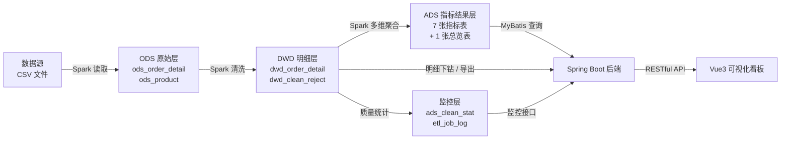

# 三、概念模型与逻辑模型设计

---

## 1. 设计思路

本项目的数据模型按**维度建模**思想组织，围绕"**订单明细**"这一事实，关联商品、用户、渠道、区域、时间等维度：

- **事实**：订单明细（一笔订单的一行商品记录），度量包括数量、单价、优惠金额、实付金额；
- **维度**：商品（含类目、品牌）、用户、渠道、区域（省/市）、时间（日/周/月）、支付方式、订单状态；
- **粒度**：最细粒度 = 一行订单商品明细（订单号 + 商品号 + 下单时间）；
- **存储分层**：原始层（ODS）→ 明细层（DWD）→ 指标结果层（ADS）。

## 2. 概念模型（E-R 图）

```mermaid
erDiagram
    PRODUCT ||--o{ ORDER_DETAIL : "被购买(1:N)"
    CATEGORY ||--o{ PRODUCT : "包含(1:N)"
    USER ||--o{ ORDER_DETAIL : "下单(1:N)"
    CHANNEL ||--o{ ORDER_DETAIL : "来源于(1:N)"
    REGION ||--o{ ORDER_DETAIL : "收货地(1:N)"
    PAY_TYPE ||--o{ ORDER_DETAIL : "支付方式(1:N)"
    ORDER_STATUS ||--o{ ORDER_DETAIL : "订单状态(1:N)"
    ORDER ||--|{ ORDER_DETAIL : "包含(1:N)"

    ORDER {
        string order_id PK "订单编号"
        datetime order_time "下单时间"
        string user_id FK "用户编号"
        string order_status FK "订单状态"
    }
    ORDER_DETAIL {
        string order_id PK,FK "订单编号"
        string product_id PK,FK "商品编号"
        string channel FK "销售渠道"
        string province FK "收货省份"
        string city "收货城市"
        string pay_type FK "支付方式"
        int quantity "购买数量"
        decimal unit_price "商品单价"
        decimal discount_amount "优惠金额"
        decimal pay_amount "实付金额"
    }
    PRODUCT {
        string product_id PK "商品编号"
        string product_name "商品名称"
        string category_id FK "类目编号"
        string brand "品牌"
        decimal cost_price "成本价"
        date launch_date "上架日期"
    }
    CATEGORY {
        string category_id PK "类目编号"
        string category_name "类目名称"
    }
    USER {
        string user_id PK "用户编号"
    }
    CHANNEL {
        string channel PK "渠道名称"
        string channel_type "渠道类型：自营/第三方"
    }
    REGION {
        string province PK "省份"
        string city "城市"
        string region_group "大区：华东/华南/华北…"
    }
    PAY_TYPE {
        string pay_type PK "支付方式"
    }
    ORDER_STATUS {
        string status PK "状态名称"
        boolean is_valid "是否计入 GMV"
    }
}

TIME_DIMENSION {
    date stat_date PK "统计日期"
    string stat_month "月份 yyyy-MM"
    string stat_week "周 yyyy-Www"
    int weekday "星期几"
    boolean is_weekend "是否周末"
}
ORDER_DETAIL ||--o{ TIME_DIMENSION : "发生在(1:N)"
```

**实体说明**

| 实体 | 说明 | 是否物理表 |
| --- | --- | --- |
| 订单明细 ORDER_DETAIL | 核心事实表 | 是（`ods_order_detail` / `dwd_order_detail`） |
| 商品 PRODUCT | 商品主数据 | 是（`ods_product`） |
| 类目 CATEGORY | 商品分类，与商品为 1:N | 否，作为商品属性内嵌 |
| 用户 USER | 仅保留脱敏编号 | 否，作为事实表字段 |
| 渠道 CHANNEL | 销售来源 | 否，作为事实表字段 |
| 区域 REGION | 收货省/市 | 否，作为事实表字段 |
| 支付方式 PAY_TYPE | 支付渠道 | 否，作为事实表字段 |
| 订单状态 ORDER_STATUS | 状态枚举，决定是否计入 GMV | 否，作为事实表字段 |
| 时间 TIME_DIMENSION | 派生自下单时间 | 否，派生为 `stat_date`/`stat_month`/`stat_week` |

> 说明：本项目为分析型（OLAP）场景，除商品主数据外，其余维度均以**反范式**方式内嵌在事实表中，
> 这是数据仓库宽表建模的常规做法，可显著减少查询时的关联开销。生产环境中若需支持维度属性变更，
> 则应拆分为独立维度表并使用缓慢变化维（SCD）处理。

---

## 3. 逻辑模型（数据仓库分层）

### 3.1 分层设计



| 层次 | 定位 | 特征 | 表清单 |
| --- | --- | --- | --- |
| ODS | 原始数据层 | 与数据源字段一一对应，全部按字符串存储，保留脏数据原貌 | `ods_order_detail`、`ods_product` |
| DWD | 明细数据层 | 完成清洗与类型规整，字段可直接参与计算，含派生维度 | `dwd_order_detail`、`dwd_clean_reject` |
| ADS | 指标结果层 | 面向具体分析主题，预先聚合，供接口直接查询 | `ads_overview`、`ads_daily_trend`、`ads_category_stat`、`ads_product_stat`、`ads_channel_stat`、`ads_paytype_stat`、`ads_region_stat`、`ads_channel_category_stat` |
| 监控 | 运行监控层 | 记录数据质量与作业运行情况 | `ads_clean_stat`、`etl_job_log` |

### 3.2 表结构设计

#### （1）ODS 层

**`ods_order_detail`** — 订单明细原始表

| 字段 | 类型 | 约束 | 说明 |
| --- | --- | --- | --- |
| id | BIGINT | PK, AUTO_INCREMENT | 自增主键 |
| order_id | VARCHAR(64) | INDEX | 订单编号 |
| order_time | VARCHAR(32) | | 下单时间（原始字符串） |
| user_id | VARCHAR(32) | | 用户编号 |
| product_id | VARCHAR(32) | | 商品编号 |
| channel | VARCHAR(32) | | 销售渠道 |
| province | VARCHAR(32) | | 收货省份 |
| city | VARCHAR(64) | | 收货城市 |
| quantity | VARCHAR(16) | | 购买数量（原始字符串） |
| unit_price | VARCHAR(16) | | 商品单价（原始字符串） |
| discount_amount | VARCHAR(16) | | 优惠金额（原始字符串） |
| pay_amount | VARCHAR(16) | | 实付金额（原始字符串） |
| order_status | VARCHAR(24) | | 订单状态 |
| pay_type | VARCHAR(24) | | 支付方式 |
| batch_id | VARCHAR(40) | INDEX | 数据批次号 |

**`ods_product`** — 商品维度原始表

| 字段 | 类型 | 约束 | 说明 |
| --- | --- | --- | --- |
| id | BIGINT | PK, AUTO_INCREMENT | 自增主键 |
| product_id | VARCHAR(32) | INDEX | 商品编号 |
| product_name | VARCHAR(128) | | 商品名称 |
| category_id | VARCHAR(32) | | 类目编号 |
| category_name | VARCHAR(64) | | 类目名称 |
| brand | VARCHAR(64) | | 品牌 |
| cost_price | VARCHAR(16) | | 成本价 |
| launch_date | VARCHAR(32) | | 上架日期 |
| batch_id | VARCHAR(40) | | 数据批次号 |

#### （2）DWD 层

**`dwd_order_detail`** — 订单明细清洗表（核心明细表）

| 字段 | 类型 | 约束 | 说明 |
| --- | --- | --- | --- |
| id | BIGINT | PK, AUTO_INCREMENT | 自增主键 |
| order_id | VARCHAR(64) | NOT NULL | 订单编号 |
| order_time | DATETIME | NOT NULL | 下单时间（已规整） |
| stat_date | DATE | NOT NULL, 索引 | 统计日期 |
| stat_month | VARCHAR(7) | NOT NULL | 月份 yyyy-MM |
| stat_week | VARCHAR(12) | | 周 yyyy-Www |
| user_id | VARCHAR(32) | 索引 | 用户编号 |
| product_id | VARCHAR(32) | NOT NULL, 索引 | 商品编号 |
| product_name | VARCHAR(128) | | 商品名称（关联维度） |
| category_id | VARCHAR(32) | NOT NULL | 类目编号 |
| category_name | VARCHAR(64) | NOT NULL | 类目名称 |
| brand | VARCHAR(64) | | 品牌 |
| channel | VARCHAR(32) | 索引(复合) | 销售渠道 |
| province | VARCHAR(32) | NOT NULL | 收货省份（空值已填充） |
| city | VARCHAR(64) | NOT NULL | 收货城市（空值已填充） |
| quantity | INT | NOT NULL | 购买数量 |
| unit_price | DECIMAL(12,2) | NOT NULL | 商品单价 |
| discount_amount | DECIMAL(12,2) | NOT NULL | 优惠金额 |
| pay_amount | DECIMAL(14,2) | NOT NULL | 实付金额（已按公式修正） |
| order_status | VARCHAR(24) | | 订单状态（标准化后） |
| pay_type | VARCHAR(24) | NOT NULL | 支付方式（空值已填充） |
| is_valid_order | TINYINT(1) | NOT NULL | 是否有效订单 |
| batch_id | VARCHAR(40) | | 数据批次号 |
| create_time | DATETIME | | 入库时间 |

索引设计：`(stat_date)`、`(stat_date, category_id)`、`(stat_date, channel)`、`(stat_date, province)`、`(stat_date, pay_type)`、`(product_id)`、`(user_id)`
——均以 `stat_date` 为前导列，匹配"先按时间范围过滤、再按维度分组"的查询模式。

**`dwd_clean_reject`** — 清洗异常数据留痕表

| 字段 | 类型 | 说明 |
| --- | --- | --- |
| id | BIGINT | 自增主键 |
| batch_id | VARCHAR(40) | 批次号 |
| rule_code | VARCHAR(16) | 违反的规则编码（R03/R04/R05） |
| rule_desc | VARCHAR(128) | 规则说明 |
| order_id | VARCHAR(64) | 订单编号 |
| product_id | VARCHAR(32) | 商品编号 |
| raw_record | VARCHAR(512) | 原始记录片段 |
| create_time | DATETIME | 记录时间 |

#### （3）ADS 层

ADS 层的设计原则：**按"统计日期 + 分析维度"存储全量聚合值，排名与占比由后端在查询时计算**。
这样前端切换日期范围时，排行榜与占比能够正确联动，而不会被固定的 TopN 截断数据限制。

| 表名 | 粒度 | 度量字段 | 用途 |
| --- | --- | --- | --- |
| `ads_overview` | 全周期 × 指标 | kpi_value | 指标卡 |
| `ads_daily_trend` | 天 | gmv、order_cnt、valid_order_cnt、sales_qty、buyer_cnt、avg_order_amount、refund_order_cnt、refund_rate | 趋势折线图 |
| `ads_category_stat` | 天 × 类目 | gmv、sales_qty、order_cnt、buyer_cnt | 类目排行 |
| `ads_product_stat` | 天 × 商品 | gmv、sales_qty、order_cnt | 商品排行 |
| `ads_channel_stat` | 天 × 渠道 | gmv、order_cnt、sales_qty、buyer_cnt | 渠道占比 |
| `ads_paytype_stat` | 天 × 支付方式 | gmv、order_cnt | 支付方式占比 |
| `ads_region_stat` | 天 × 省份 | gmv、order_cnt、buyer_cnt | 省份排行 |
| `ads_channel_category_stat` | 天 × 渠道 × 类目 | gmv、order_cnt | 渠道×类目交叉对比 |

以 `ads_daily_trend` 为例：

| 字段 | 类型 | 说明 |
| --- | --- | --- |
| id | BIGINT | 自增主键 |
| stat_date | DATE | 统计日期（唯一索引） |
| order_cnt | BIGINT | 下单量（去重订单数） |
| valid_order_cnt | BIGINT | 有效订单量 |
| gmv | DECIMAL(20,2) | 成交金额 |
| sales_qty | BIGINT | 销售件数 |
| buyer_cnt | BIGINT | 下单用户数 |
| avg_order_amount | DECIMAL(14,2) | 客单价 |
| refund_order_cnt | BIGINT | 退款订单量 |
| refund_rate | DECIMAL(10,4) | 退款率 |
| update_time | DATETIME | 更新时间 |

`ads_overview` 采用"指标编码 + 指标值"的纵表结构，便于后续扩展指标而无需改表：

| kpi_code | kpi_name | kpi_unit | 说明 |
| --- | --- | --- | --- |
| GMV | 成交金额 | 元 | 有效订单实付金额之和 |
| ORDER_CNT | 下单量 | 单 | 去重订单编号数量 |
| VALID_ORDER_CNT | 有效订单量 | 单 | 已完成/已支付订单数 |
| SALES_QTY | 销售件数 | 件 | 有效订单购买数量之和 |
| BUYER_CNT | 下单用户数 | 人 | 去重用户数 |
| AVG_ORDER_AMOUNT | 客单价 | 元 | GMV ÷ 有效订单量 |
| AVG_ITEM_PRICE | 件单价 | 元 | GMV ÷ 销售件数 |
| REFUND_RATE | 退款率 | % | 退款订单量 ÷ 下单量 |
| DISCOUNT_RATE | 折扣率 | % | 优惠金额 ÷ 原价金额 |

#### （4）监控层

**`ads_clean_stat`** — 数据质量统计：raw_cnt、null_field_cnt、dup_record_cnt、invalid_time_cnt、invalid_amount_cnt、invalid_status_cnt、missing_dim_cnt、valid_cnt、discard_cnt、quality_score、duration_ms
**`etl_job_log`** — 作业运行记录：batch_id、job_name、compute_mode（RDD/DATAFRAME）、start_time、end_time、duration_ms、input_rows、output_rows、job_status、remark

---

## 4. 指标定义表

| 指标编码 | 指标名称 | 计算口径 | 数据来源 | 单位 | 是否可加 |
| --- | --- | --- | --- | --- | --- |
| GMV | 成交金额 | Σ(实付金额)，限 `is_valid_order = 1` | dwd_order_detail | 元 | 是 |
| ORDER_CNT | 下单量 | COUNT(DISTINCT order_id)，含全部状态 | dwd_order_detail | 单 | 是（按天不重复） |
| VALID_ORDER_CNT | 有效订单量 | COUNT(DISTINCT order_id)，限 `is_valid_order = 1` | dwd_order_detail | 单 | 是（按天不重复） |
| SALES_QTY | 销售件数 | Σ(数量)，限有效订单 | dwd_order_detail | 件 | 是 |
| BUYER_CNT | 下单用户数 | COUNT(DISTINCT user_id)，限有效订单 | dwd_order_detail | 人 | **否** |
| AVG_ORDER_AMOUNT | 客单价 | GMV ÷ 有效订单量 | 派生计算 | 元 | **否** |
| AVG_ITEM_PRICE | 件单价 | GMV ÷ 销售件数 | 派生计算 | 元 | **否** |
| REFUND_RATE | 退款率 | 退款订单量 ÷ 下单量 × 100% | 派生计算 | % | **否** |
| DISCOUNT_RATE | 折扣率 | Σ(优惠金额) ÷ Σ(数量 × 单价) × 100%，限有效订单 | 派生计算 | % | **否** |
| CATEGORY_GMV | 类目成交金额 | Σ(实付金额)，按 `category_name` 分组 | dwd_order_detail | 元 | 是 |
| CHANNEL_GMV | 渠道成交金额 | Σ(实付金额)，按 `channel` 分组 | dwd_order_detail | 元 | 是 |
| REGION_GMV | 区域成交金额 | Σ(实付金额)，按 `province` 分组 | dwd_order_detail | 元 | 是 |

**口径统一说明**

1. "有效订单"是本项目的基础口径，定义为 `order_status ∈ {已完成, 已支付}`；
2. 待付款、已取消、已退款订单**不计入 GMV**，但**计入下单量**，用于计算退款率；
3. 不可加指标（用户数、客单价、件单价、各类率值）**不能跨天直接求和**，因此数据一致性校验只覆盖可加指标；
4. 类目/渠道维度的"订单量"为该维度下有效订单的去重订单数，一笔跨类目的订单会在多个类目下各计一次，
   这是分组统计的固有特征，在解读时可加性指标时需注意。
