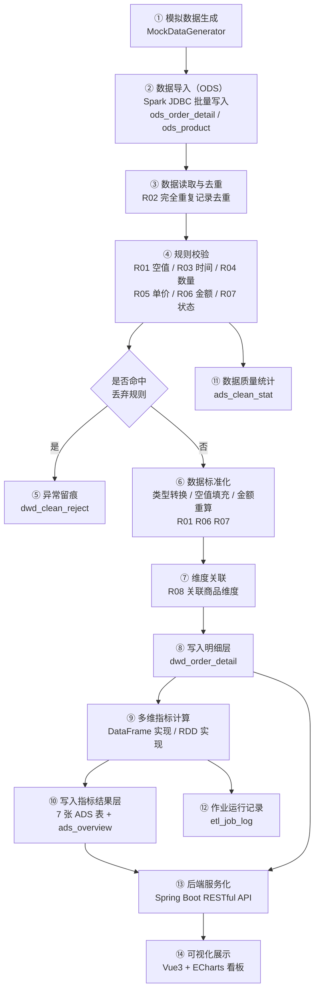
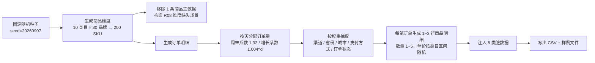
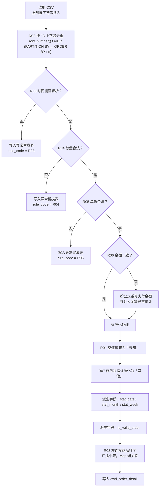
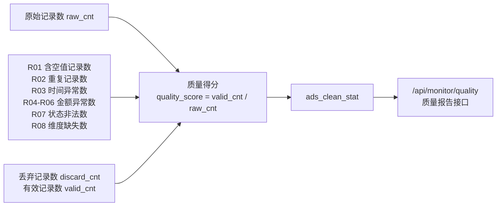
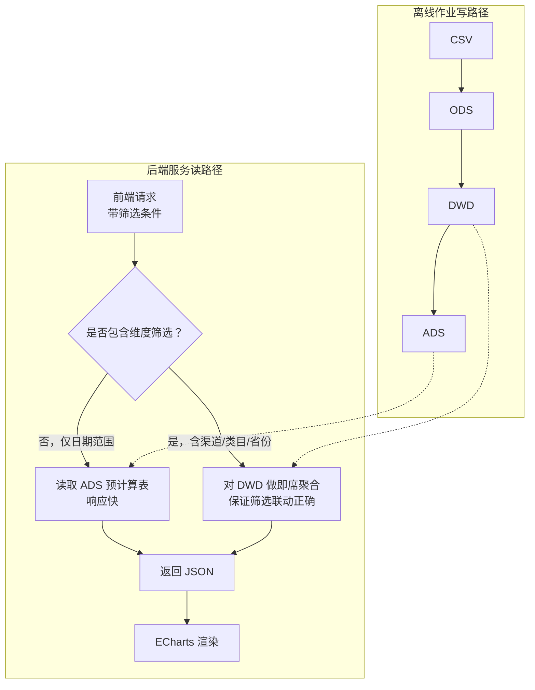
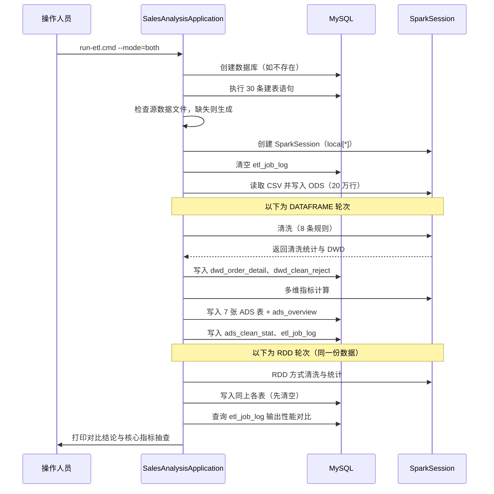

# 四、数据处理流程

---

## 1. 总体处理链路



整个作业的入口是 `com.sales.SalesAnalysisApplication`，执行步骤如下：

| 步骤 | 动作 | 关键类 |
| --- | --- | --- |
| 1 | 加载配置、设置 `hadoop.home.dir` | `JobConfig` |
| 2 | 确保数据库存在（服务级连接创建 DB） | `MysqlSink.ensureDatabase` |
| 3 | 执行建表脚本（30 条 DDL） | `SchemaInitializer` |
| 4 | 生成模拟数据（若源文件不存在） | `MockDataGenerator` |
| 5 | 创建 SparkSession（local[*]） | `SalesAnalysisApplication` |
| 6 | ODS 装载（公共前置步骤，只执行一次） | `OdsLoader` |
| 7 | 按指定方式执行清洗 + 统计 + 落库 | `DataFrameCleaner` / `RddAnalysis` |
| 8 | 输出两种方式的性能对比与结果抽查 | `SalesAnalysisApplication` |

---

## 2. 数据生成流程



**关键设计点**

1. **固定随机种子**：保证数据可复现，同一份数据多次运行指标结果完全一致；
2. **时间分布真实**：周末系数 1.32 模拟周末消费高峰；日内按"午间（10-12 点）+ 夜间（19-21 点）"双高峰分布；
3. **权重差异化**：不同类目价格区间、不同省份消费能力、不同渠道占比均按真实电商特征设置；
4. **存在复购**：用户池 6 万人产生 10.7 万笔订单，人均 1.8 单，可支撑用户维度分析；
5. **刻意构造脏数据**：8 类脏数据按比例注入，作为清洗环节的输入，避免"清洗代码没有脏数据可清"的尴尬。

---

## 3. 数据清洗流程

### 3.1 清洗规则总览

| 规则 | 检查内容 | 判定条件 | 处理动作 | 是否丢弃 |
| --- | --- | --- | --- | --- |
| R01 | 空值 | `province` / `city` / `pay_type` 为空（null 或空串） | 填充为"未知" | 否 |
| R02 | 重复记录 | 13 个业务字段完全相同的记录 | 按行号保留第一条 | 否（去重） |
| R03 | 时间格式 | 无法按三种约定格式解析 | 记录到留痕表 | 是 |
| R04 | 数量合法性 | `quantity` ≤ 0 或 > 999，或无法解析为整数 | 记录到留痕表 | 是 |
| R05 | 单价合法性 | `unit_price` ≤ 0，或无法解析为数值 | 记录到留痕表 | 是 |
| R06 | 金额一致性 | \|`pay_amount` − (`quantity` × `unit_price` − `discount_amount`)\| > 0.01 | 按公式重算 `pay_amount` | 否 |
| R07 | 状态合法性 | `order_status` 不在 {已完成, 已支付, 待付款, 已取消, 已退款} 内 | 标准化为"其他" | 否 |
| R08 | 维度完整性 | `product_id` 在商品维度表中不存在 | 类目填充为"未知类目" | 否 |

### 3.2 清洗流程图



### 3.3 关键实现要点

**（1）时间格式规整**

源数据存在三种合法格式和多种非法值，采用 `coalesce` 依次尝试解析，全部失败即视为脏数据：

```java
Column ts = functions.coalesce(
        to_timestamp(col("order_time"), "yyyy-MM-dd HH:mm:ss"),
        to_timestamp(col("order_time"), "yyyy/MM/dd HH:mm"),
        to_timestamp(col("order_time"), "yyyy-MM-dd'T'HH:mm:ss"));
Column badTime = ts.isNull();
```

**（2）金额一致性校验与修正**

```java
Column computedPay = round(qty.cast(DecimalType(20,4))
        .multiply(price)
        .minus(discount.cast(DecimalType(20,4))), 2)
        .cast(DecimalType(14,2));

Column badAmount = badQty.or(badPrice)
        .or(payAmount.isNull())
        .or(abs(payAmount.minus(computedPay)).gt(lit(new BigDecimal("0.01"))));
```

注意"金额不一致"与"数量/单价非法"的处理策略不同：前者可修正（保留记录、按公式重算），
后者不可修正（数量为负或单价为负时无法还原真实值，只能丢弃）。

**（3）去重的稳定性**

去重使用窗口函数，并用 `monotonically_increasing_id()` 生成的稳定行号作为排序依据，
避免 `ORDER BY 常量` 造成的非确定性结果：

```java
WindowSpec w = Window.partitionBy(业务字段).orderBy(col("rid"));
Dataset<Row> deduped = raw.withColumn("rid", monotonically_increasing_id())
        .withColumn("rn", row_number().over(w))
        .filter(col("rn").equalTo(1))
        .drop("rn", "rid");
```

**（4）维度关联的容错**

使用左连接 + 广播小表，并对关联不上的记录填充默认值，绝不因为维度缺失而丢掉事实数据：

```java
dwdBase.join(broadcast(productDim), dwdBase.col("product_id").equalTo(productDim.col("dim_product_id")), "left")
       .withColumn("category_name", coalesce(col("dim_category_name"), lit("未知类目")));
```

---

## 4. 数据质量统计流程

在清洗过程中同步统计各规则命中量，写入 `ads_clean_stat` 表：



**统计口径说明**

- 各规则计数器统计的是"**规则命中次数**"，同一行可能同时命中多条规则，因此各计数之和可能大于 `discard_cnt`；
- `discard_cnt` 为"至少命中一条丢弃规则（R03/R04/R05）"的记录数（去重计数）；
- `valid_cnt = raw_cnt − dup_record_cnt − discard_cnt`；
- `quality_score = valid_cnt / raw_cnt`。

---

## 5. 多维指标计算流程

### 5.1 指标计算逻辑

所有指标均以 DWD 明细表为唯一数据源，通过条件聚合（`CASE WHEN`）区分有效订单：

```sql
-- 每日趋势（DWD 即席聚合路径）
SELECT stat_date,
       COUNT(DISTINCT order_id)                                        AS orderCnt,
       COUNT(DISTINCT CASE WHEN is_valid_order = 1 THEN order_id END)   AS validOrderCnt,
       SUM(CASE WHEN is_valid_order = 1 THEN pay_amount ELSE 0 END)     AS gmv,
       SUM(CASE WHEN is_valid_order = 1 THEN quantity ELSE 0 END)       AS salesQty,
       COUNT(DISTINCT CASE WHEN is_valid_order = 1 THEN user_id END)    AS buyerCnt,
       COUNT(DISTINCT CASE WHEN order_status = '已退款' THEN order_id END) AS refundOrderCnt
FROM dwd_order_detail
WHERE stat_date BETWEEN ? AND ?
GROUP BY stat_date
ORDER BY stat_date;
```

这样处理的目的是：**下单量需要包含取消/退款订单，而 GMV 只统计有效订单**，
若在 WHERE 中直接过滤 `is_valid_order = 1`，会连带把下单量也算错。

### 5.2 维度统计的聚合设计

| 输出表 | 分组键 | 度量 |
| --- | --- | --- |
| `ads_daily_trend` | stat_date | 完整指标集 |
| `ads_category_stat` | stat_date, category_id, category_name | gmv、sales_qty、order_cnt、buyer_cnt |
| `ads_product_stat` | stat_date, product_id, product_name, category_name, brand | gmv、sales_qty、order_cnt |
| `ads_channel_stat` | stat_date, channel | gmv、order_cnt、sales_qty、buyer_cnt |
| `ads_paytype_stat` | stat_date, pay_type | gmv、order_cnt |
| `ads_region_stat` | stat_date, province | gmv、order_cnt、buyer_cnt |
| `ads_channel_category_stat` | stat_date, channel, category_name | gmv、order_cnt |

### 5.3 两种计算方式的实现差异

提高层要求"比较不同处理方式的运行效果"，因此同一套指标用两种 API 各实现一次：

| 对比项 | DataFrame / SparkSQL 实现 | RDD 实现 |
| --- | --- | --- |
| 所在类 | `DataFrameCleaner` + `DataFrameAnalysis` | `RddAnalysis` |
| 数据读取 | `spark.read().schema(...).csv(path)` 自动解析 | `textFile(path)` 按行读取后手工 `split(",")` |
| 类型处理 | 内置类型转换（`cast`），非法值自动为 null | 逐字段 `parseInt` / `parseDecimal` 手工校验 |
| 去重 | `row_number() OVER (PARTITION BY ...)` 窗口函数 | `distinct()` 按整行字符串去重 |
| 时间解析 | `to_timestamp(col, pattern)` + `coalesce` | `SimpleDateFormat` 依次尝试三种格式 |
| 分组聚合 | `groupBy().agg(countDistinct/sum/when)` | `mapToPair().groupByKey()` + 自定义累加器 `GroupStat` |
| 维度关联 | `broadcast()` 广播 Join | `Broadcast` 变量 + `Map` 手动关联 |
| 结果写出 | 直接落库 | 转 `Row` 后落库 |
| 代码量 | 约 300 行 | 约 620 行 |
| 可读性 | 高（声明式，接近 SQL） | 较低（需手工管理序列化与累加器） |
| 开发效率 | 高 | 低 |

**实测耗时对比**（20 万行输入，单机 4 分区，详见《六、运行调试与测试分析》）：

| 计算方式 | 总耗时 | 清洗耗时 | 统计与落库耗时 |
| --- | --- | --- | --- |
| DataFrame / SparkSQL | **36,628 ms** | 12,216 ms | 24,412 ms |
| RDD | **51,747 ms** | 4,266 ms | 47,481 ms |

结论：DataFrame 整体快 **41.3%**。RDD 在清洗阶段反而更快（一次 map 转换，无额外开销），
但聚合阶段 DataFrame 凭借 Catalyst 优化与 Tungsten 编码明显胜出（24.4s vs 47.5s）。
随着数据量与计算复杂度提升，DataFrame 的优势会进一步放大。

---

## 6. 数据流向与查询策略



**为什么采用"预计算 + 即席查询"混合策略**

| 方案 | 优点 | 缺点 |
| --- | --- | --- |
| 全部预计算（枚举所有维度组合） | 查询最快 | 维度组合爆炸：10 类目 × 5 渠道 × 20 省份 × 91 天 ≈ 9.1 万行/表，且新增筛选维度需重跑全量 |
| 全部即席查询 | 任意筛选组合都正确 | 看板首屏每次都要扫明细表，数据量增长后响应变慢 |
| **混合（本项目采用）** | 首屏走预计算保证速度，筛选走即席保证正确性；同时可交叉校验两者一致性 | 需要维护两条查询路径，须保证口径一致 |

口径一致性由 `GET /api/monitor/consistency` 接口保障：自动比对 ADS 预计算值与 DWD 明细汇总值，
差值超过容差即标记为"不一致"，作为数据正确性测试的常规手段。

---

## 7. 作业运行流程（时序）


