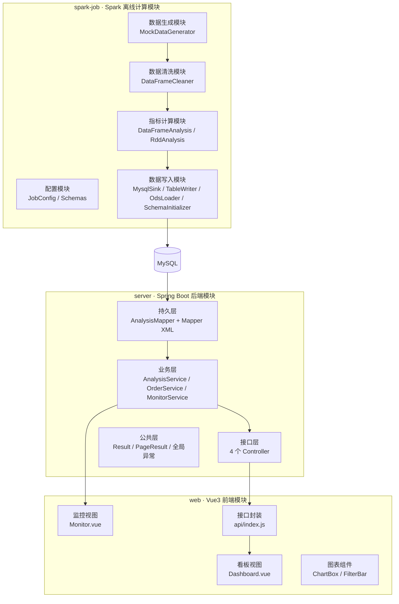

# 五、核心模块实现思路与关键代码

---

## 1. 功能模块划分



| 模块 | 类 / 文件 | 职责 |
| --- | --- | --- |
| 数据生成 | `MockDataGenerator` | 按真实业务分布生成商品维度与订单明细，并按固定比例注入 8 类脏数据 |
| 配置 | `JobConfig`、`Schemas` | 配置加载优先级（classpath → 外部文件 → 系统属性）；常量与表结构集中定义 |
| 数据清洗 | `DataFrameCleaner` | DataFrame 实现：读源数据、8 条规则校验、派生字段、维度关联 |
| 数据清洗 | `RddAnalysis`（含解析部分） | RDD 实现：按行读取、手工解析、规则校验 |
| 指标计算 | `DataFrameAnalysis` | DataFrame 实现：7 张维度表 + 总览指标 |
| 指标计算 | `RddAnalysis` | RDD 实现：`mapToPair + groupByKey + 自定义累加器` |
| 数据写入 | `MysqlSink` | 连接管理、DDL 执行、批量插入、幂等清表 |
| 数据写入 | `TableWriter`、`OdsLoader` | DataFrame / RDD 结果统一写库；大表用 Spark JDBC 分批写入 |
| 后端接口 | `DashboardController` 等 | 9 个看板接口 + 2 个明细接口 + 3 个监控接口 |
| 后端业务 | `AnalysisService` | 查询路径决策、占比与排名计算、一致性校验 |
| 前端 | `Dashboard.vue`、`Monitor.vue` | 图表渲染、筛选联动、明细下钻与导出 |

---

## 2. 数据生成模块

### 2.1 实现思路

生成器需要解决三个问题：**数据要像真的**、**结果要可复现**、**要留下可清洗的脏数据**。

```java
// 固定随机种子 —— 保证每次生成的数据完全一致，作业结果可复现
Random random = new Random(config.mockSeed());     // seed = 20260907
```

**按天分配订单量**，模拟周末高峰与缓慢增长趋势：

```java
for (int d = 0; d < days; d++) {
    LocalDate date = start.plusDays(d);
    double weekendFactor = (date.getDayOfWeek().getValue() >= 6) ? 1.32 : 1.0;
    double growthFactor = 1.0 + 0.004 * d;
    dayWeights[d] = weekendFactor * growthFactor;
}
```

**按权重随机**，让渠道、省份、支付方式、订单状态符合真实分布：

```java
private static int weightedIndex(double[] weights, Random random) {
    double total = 0;
    for (double w : weights) total += w;
    double r = random.nextDouble() * total;
    double acc = 0;
    for (int i = 0; i < weights.length; i++) {
        acc += weights[i];
        if (r < acc) return i;
    }
    return weights.length - 1;
}
```

**注入脏数据**（节选）：

```java
// R01 空值
if (random.nextDouble() < 0.010) provinceText = "";
// R04 数量非法
if (random.nextDouble() < 0.005) {
    int[] bad = {0, -1, 99999};
    qtyText = String.valueOf(bad[random.nextInt(bad.length)]);
}
// R06 金额不一致
if (random.nextDouble() < 0.010) {
    payText = String.format("%.2f", round2(payAmount * (1.2 + random.nextDouble() * 0.5)));
}
// R02 重复记录：紧邻写入同一条记录
if (random.nextDouble() < 0.012) {
    w.write(line); w.newLine(); rows++;
}
```

### 2.2 实现效果

| 项目 | 结果 |
| --- | --- |
| 生成耗时 | 约 8 秒（20 万行） |
| 订单明细 | 200,177 行 / 25.7 MB |
| 商品维度 | 199 条 |
| 样例数据 | 2000 行 + 60 行，随仓库提交 |

---

## 3. 数据清洗模块

### 3.1 实现思路

清洗模块的定位是"**尽可能保住数据，只丢弃真正无法使用的记录**"，因此把规则分为两类：

| 类别 | 规则 | 策略 |
| --- | --- | --- |
| 可修复 | R01 空值、R06 金额不一致、R07 状态非法、R08 维度缺失 | 填充 / 重算 / 标准化，保留记录 |
| 不可修复 | R03 时间无法解析、R04 数量非法、R05 单价非法 | 丢弃，但写入留痕表 |

### 3.2 关键代码

**（1）读取源数据：全部按字符串读入**

```java
Dataset<Row> rawOrders = spark.read()
        .option("header", "true")
        .option("encoding", "UTF-8")
        .option("mode", "PERMISSIVE")
        .schema(Schemas.orderRawSchema())   // 13 个字段全部 StringType
        .csv(orderPath);
```

这样的好处是：类型非法（如 `quantity = "abc"`）不会在读取阶段抛异常，
而是留到校验阶段由 `cast` 得到 null 后统一处理。

**（2）去重：窗口函数 + 稳定行号**

```java
Dataset<Row> rawWithId = rawOrders.withColumn("rid", functions.monotonically_increasing_id());
WindowSpec dedupWindow = Window.partitionBy(业务字段数组).orderBy(col("rid"));
Dataset<Row> deduped = rawWithId
        .withColumn("rn", row_number().over(dedupWindow))
        .filter(col("rn").equalTo(1))
        .drop("rn", "rid");
```

**（3）空值填充：`nullif + trim + coalesce` 组合**

```java
.withColumn("province", coalesce(nullif(trim(col("province")), lit("")), lit("未知")))
```

`nullif(trim(v), "")` 把"空串 + 纯空格"统一变成 null，再由 `coalesce` 兜底填充，
一条表达式同时处理了 null、空串、空格串三种情况。

**（4）状态标准化与有效性标记**

```java
.withColumn("order_status",
        when(col("order_status").isin((Object[]) Schemas.ORDER_STATUS_ALL), col("order_status"))
                .otherwise(lit("其他")))
.withColumn("is_valid_order",
        when(col("order_status").isin((Object[]) Schemas.ORDER_STATUS_VALID), lit(1)).otherwise(lit(0)))
```

**（5）维度关联：广播小表 + 左连接**

```java
Dataset<Row> productDim = rawProducts
        .select(col("product_id").as("dim_product_id"),
                nullif(trim(col("product_name")), lit("")).as("dim_product_name"), ...)
        .dropDuplicates("dim_product_id");

Dataset<Row> joined = dwdBase.join(broadcast(productDim),
        dwdBase.col("product_id").equalTo(productDim.col("dim_product_id")), "left");
```

商品维度仅 199 条，用 `broadcast` 广播后走 Map 端关联，避免事实表参与 Shuffle。

**（6）异常留痕：多规则命中时按优先级归因**

```java
.withColumn("rule_code",
        when(badTime, lit("R03"))
                .when(badQty, lit("R04"))
                .otherwise(lit("R05")))
.withColumn("raw_record", substring(concat_ws("|",
        col("order_id"), col("order_time"), col("quantity"),
        col("unit_price"), col("pay_amount")), 1, 500))
```

### 3.3 实测结果

| 指标 | 数值 |
| --- | --- |
| 原始记录数 | 200,177 |
| 重复记录数 | 2,381 |
| 丢弃记录数 | 4,735 |
| 有效记录数 | 193,061 |
| 数据质量得分 | 96.45% |
| 清洗耗时 | 约 8.8 秒 |

---

## 4. 指标计算模块

### 4.1 DataFrame 实现

```java
public static AnalysisResult analyze(SparkSession spark, Dataset<Row> dwd, String batchId) {
    // 有效订单判定，复用同一组表达式，保证各指标口径一致
    Column isValid = col("is_valid_order").equalTo(lit(1));
    Column validOrderId = when(isValid, col("order_id"));
    Column validPay = when(isValid, col("pay_amount")).otherwise(lit(BigDecimal.ZERO));
    Column refundOrderId = when(col("order_status").equalTo(lit("已退款")), col("order_id"));

    // 每日趋势
    r.trend = dwd.groupBy("stat_date").agg(
                    countDistinct(col("order_id")).as("order_cnt"),
                    countDistinct(validOrderId).as("valid_order_cnt"),
                    sum(validPay).as("gmv_raw"),
                    sum(validQty).as("sales_qty"),
                    countDistinct(validUserId).as("buyer_cnt"),
                    countDistinct(refundOrderId).as("refund_order_cnt"))
            ...;
}
```

关键点：`countDistinct(when(条件, 字段))` —— 条件不满足时为 null，
而 `countDistinct` 忽略 null，从而实现"仅在满足条件的记录上做去重计数"。

**总览指标**从明细一次性聚合，再在 Driver 端计算派生指标：

```java
Row agg = dwd.agg(sum(validPay).as("gmv"),
                  sum(validQty).as("sales_qty"),
                  countDistinct(validOrderId).as("valid_order_cnt"),
                  countDistinct(refundOrderId).as("refund_order_cnt"), ...).first();

kpis.add(kpi("AVG_ORDER_AMOUNT", "客单价",
        divide(gmv, BigDecimal.valueOf(Math.max(validOrderCnt, 1)), 2), "元", "GMV ÷ 有效订单量", ...));
```

### 4.2 RDD 实现

RDD 方式需要自己管理"多指标同时累加"，因此定义了一个可序列化的累加器：

```java
public static class GroupStat implements Serializable {
    final Set<String> orderIds = new HashSet<>();
    final Set<String> validOrderIds = new HashSet<>();
    final Set<String> userIds = new HashSet<>();
    final Set<String> refundOrderIds = new HashSet<>();
    BigDecimal gmv = BigDecimal.ZERO;
    long salesQty = 0;

    GroupStat add(OrderRecord r) {
        orderIds.add(r.orderId);
        if (Schemas.REFUND_STATUS.equals(r.orderStatus)) refundOrderIds.add(r.orderId);
        if (r.isValidOrder()) {
            validOrderIds.add(r.orderId);
            userIds.add(r.userId);
            gmv = gmv.add(r.payAmount);
            salesQty += r.quantity;
        }
        return this;
    }

    GroupStat merge(GroupStat other) { /* 合并各集合与累加值 */ }
}
```

分组聚合与全局聚合复用同一个累加器：

```java
// 分组：mapToPair + groupByKey + 累加
result.category = validRecords
        .mapToPair(r -> new Tuple2<>(r.statDateKey() + "|" + r.categoryId + "|" + r.categoryName, r))
        .groupByKey()
        .map(kv -> {
            GroupStat g = new GroupStat();
            for (OrderRecord r : kv._2) g.add(r);
            String[] parts = kv._1.split("\\|", -1);
            return RowFactory.create(Date.valueOf(parts[0]), parts[1], parts[2],
                    g.gmv.setScale(2, RoundingMode.HALF_UP), g.salesQty,
                    (long) g.validOrderIds.size(), (long) g.userIds.size(), now);
        });

// 全局：aggregate(zeroValue, seqOp, combOp)
GroupStat g = validRecords.aggregate(new GroupStat(), GroupStat::add, GroupStat::merge);
```

**踩坑记录 1：不能在算子内部调用 Spark 动作**

最初的实现里，类目名称是在 `map` 算子内部通过 `records.filter(...).take(1)` 回捞的，
运行后抛出 `SparkContext can only be used on the driver`。
原因是算子在 Executor 上执行，而 `SparkContext` 只存在于 Driver。
最终改为把类目名称编入分组键，彻底消除该问题。

**踩坑记录 2：`rewriteBatchedStatements` 导致行数统计错误**

开启该参数后，MySQL 驱动对批量中的每条语句返回 `SUCCESS_NO_INFO`（-2）而不是实际影响行数，
最初把返回值直接相加，导致日志显示"写入 0 行"（实际数据已正确写入）。
修正为统计"执行成功的语句数量"：

```java
private static long countBatch(int[] results) {
    long n = 0;
    for (int r : results) {
        if (r >= 0 || r == Statement.SUCCESS_NO_INFO) n++;
    }
    return n;
}
```

---

## 5. 数据写入模块

### 5.1 分层写入策略

| 数据量 | 写入方式 | 原因 |
| --- | --- | --- |
| ODS 20 万行、DWD 19 万行 | Spark JDBC 分批写入（`batchsize = 2000`） | 数据量大，不能 collect 到 Driver；交由 Spark 按分区并行写入 |
| ADS 结果（数千行） | `MysqlSink` 批量插入（`PreparedStatement.addBatch`） | 数据量小，统一走我方封装，便于统一处理空值与类型转换 |

### 5.2 建库脚本自动执行

首次运行时数据库尚不存在，若直接用带库名的连接串会连接失败，因此先用服务级连接创建数据库：

```java
public static void ensureDatabase(String url, String user, String password) {
    String db = extractDatabase(url);
    try (Connection c = DriverManager.getConnection(serverUrl(url), user, password);
         Statement st = c.createStatement()) {
        st.execute("CREATE DATABASE IF NOT EXISTS `" + db
                + "` DEFAULT CHARACTER SET utf8 COLLATE utf8_general_ci");
    }
}
```

建表脚本通过读取 `sql/01_schema.sql`、去注释后按分号切分逐条执行，
使整个项目可以"一条命令完成建库 + 生成数据 + 计算 + 落库"。

### 5.3 幂等设计

作业每次运行前 `TRUNCATE` 目标表，保证重复运行不会产生重复数据；
批次号（`batch_id`）标识每次运行，可追溯数据来源：

```java
private static String newBatchId(String mode) {
    String ts = new SimpleDateFormat("yyyyMMddHHmmss").format(new Date());
    return "B" + ts + "-" + (MODE_DATAFRAME.equals(mode) ? "DF" : "RDD");
}
```

---

## 6. 后端服务模块

### 6.1 统一响应与全局异常

```java
@Data
public class Result<T> {
    private int code;          // 0 成功，非 0 失败
    private String message;
    private T data;
    private long timestamp = System.currentTimeMillis();
}
```

```java
@RestControllerAdvice
public class GlobalExceptionHandler {
    @ExceptionHandler(BizException.class)
    public Result<Void> handleBiz(BizException e) {
        return Result.fail(e.getCode(), e.getMessage());
    }
    @ExceptionHandler(Exception.class)
    public Result<Void> handleOther(Exception e) {
        log.error("系统异常", e);
        return Result.fail(500, "系统异常：" + e.getMessage());
    }
}
```

### 6.2 查询路径决策（核心设计）

```java
public List<TrendPointVO> trend(AnalysisQuery query) {
    prepare(query);
    if (!hasDimensionFilter(query)) {
        // 仅日期范围筛选 → 读取预计算表，响应快
        List<TrendPointVO> fromAds = analysisMapper.selectTrendFromAds(query);
        if (fromAds != null && !fromAds.isEmpty()) {
            return fromAds;
        }
        log.warn("预计算趋势表为空，自动切换为即席聚合");
    }
    // 含渠道/类目/省份/支付方式筛选 → 对明细表做即席聚合，保证联动正确
    return analysisMapper.selectTrendFromDwd(query);
}

private boolean hasDimensionFilter(AnalysisQuery q) {
    return isNotBlank(q.getChannel()) || isNotBlank(q.getCategoryName())
            || isNotBlank(q.getProvince()) || isNotBlank(q.getPayType());
}
```

### 6.3 多维条件查询：MyBatis 动态 SQL

```xml
<sql id="dwdDimWhere">
    <if test="q.startDate != null and q.startDate != ''"> AND stat_date &gt;= #{q.startDate} </if>
    <if test="q.endDate != null and q.endDate != ''"> AND stat_date &lt;= #{q.endDate} </if>
    <if test="q.channel != null and q.channel != ''"> AND channel = #{q.channel} </if>
    <if test="q.categoryName != null and q.categoryName != ''"> AND category_name = #{q.categoryName} </if>
    <if test="q.province != null and q.province != ''"> AND province = #{q.province} </if>
    <if test="q.onlyValid != null and q.onlyValid == 1"> AND is_valid_order = 1 </if>
</sql>
```

所有条件都用 `#{}` 预编译占位符，避免 SQL 注入。

### 6.4 排名与占比：在后端计算而非固化到结果表

```java
private List<MetricItemVO> fillRatioAndRank(List<MetricItemVO> list) {
    BigDecimal total = BigDecimal.ZERO;
    for (MetricItemVO item : list) {
        item.setGmv(item.getGmv().setScale(2, RoundingMode.HALF_UP));
        total = total.add(item.getGmv());
    }
    int rank = 1;
    for (MetricItemVO item : list) {
        item.setRankNo(rank++);
        item.setRatio(total.compareTo(BigDecimal.ZERO) == 0 ? BigDecimal.ZERO
                : item.getGmv().multiply(HUNDRED).divide(total, 2, RoundingMode.HALF_UP));
    }
    return list;
}
```

这样设计的原因：如果排名与占比在离线阶段固化到结果表，那么前端切换日期范围后，
排行榜仍然是"全周期 TopN 截断后的数据"，占比也无法重算。放在查询阶段计算才能保证联动正确。

### 6.5 明细分页与导出

```java
// 分页：MyBatis-Plus 物理分页
Page<DwdOrderDetail> page = new Page<>(current, query.pageSizeOrDefault());
Page<DwdOrderDetail> result = orderMapper.selectPage(page, buildWrapper(query));

// 导出：带 UTF-8 BOM，保证 Excel 打开中文不乱码
out.write(new byte[]{(byte) 0xEF, (byte) 0xBB, (byte) 0xBF});
BufferedWriter writer = new BufferedWriter(new OutputStreamWriter(out, StandardCharsets.UTF_8));
writer.write(String.join(",", EXPORT_HEADERS));
```

CSV 字段做了转义处理，字段中含逗号、引号或换行时用双引号包裹并把内部引号双写。

### 6.6 数据一致性校验

```java
public List<ConsistencyItemVO> consistency() {
    Map<String, Object> ads = analysisMapper.sumTrendFromAds();   // 预计算表汇总
    Map<String, Object> dwd = analysisMapper.sumFromDwd();        // 明细表实时汇总
    items.add(check("GMV 合计", decimal(ads, "gmv"), decimal(dwd, "gmv"), "元", true));
    items.add(check("销售件数合计", decimal(ads, "salesQty"), decimal(dwd, "salesQty"), "件", false));
    items.add(check("有效订单量合计", decimal(ads, "validOrderCnt"), decimal(dwd, "validOrderCnt"), "单", false));
    items.add(check("类目 GMV 合计", sumCategoryGmvFromAds(), sumCategoryGmvFromDwd(), "元", true));
    ...
}
```

---

## 7. 前端可视化模块

### 7.1 图表容器复用

ECharts 的初始化和销毁逻辑封装在一个组件里，业务视图只负责提供 `option`：

```vue
<script setup>
const props = defineProps({ option: { type: Object, required: true }, height: { type: String, default: '320px' } })
const el = ref(null)
let chart = null

function render() {
  if (!el.value) return
  if (!chart) chart = echarts.init(el.value)
  chart.setOption(props.option, true)   // 第二个参数 true 表示不合并，避免残留旧系列
  chart.resize()
}

onMounted(async () => { await nextTick(); render(); window.addEventListener('resize', onResize) })
onBeforeUnmount(() => { window.removeEventListener('resize', onResize); chart?.dispose() })
watch(() => props.option, async () => { await nextTick(); render() }, { deep: true })
</script>
```

### 7.2 筛选联动

筛选条件集中在 `filters` 对象中，任一条件变化后统一触发 `loadAll()`，
使用 `Promise.all` 并行请求 8 个接口，再一次性更新所有图表数据：

```js
async function loadAll() {
  const q = { ...filters.value }
  const [kpi, tr, cat, prod, ch, pay, reg, chCat] = await Promise.all([
    api.overview(q), api.trend(q), api.categoryTopN(q), api.productTopN(q),
    api.channelDist(q), api.paytypeDist(q), api.regionTopN(q), api.channelCategory(q)
  ])
  overview.value = kpi || []
  trend.value = tr || []
  // ...
  await loadDetail(1)   // 明细回到第一页
}
```

### 7.3 渠道 × 类目交叉对比的处理

交叉数据是扁平的"渠道 × 类目"列表，需要在前端转成 ECharts 需要的"横轴为类目、系列为渠道"结构：

```js
const topCats = Object.keys(catTotal).sort((a, b) => catTotal[b] - catTotal[a]).slice(0, 6)
const series = channelNames.map((ch, idx) => ({
  name: ch,
  type: 'bar',
  itemStyle: { color: PALETTE[idx % PALETTE.length] },
  data: topCats.map((cat) => {
    const hit = rows.find((r) => r.channel === ch && r.categoryName === cat)
    return hit ? Number(hit.gmv) : 0
  })
}))
```

---

## 8. 代码规模统计

| 模块 | 文件数 | 代码行数（约） |
| --- | --- | --- |
| spark-job（Java） | 10 | 2,100 |
| server（Java + XML） | 24 | 1,700 |
| web（Vue / JS / CSS） | 13 | 1,500 |
| sql | 1 | 330 |
| docs | 8 | — |
| **合计** | **56** | **约 5,600 行** |
